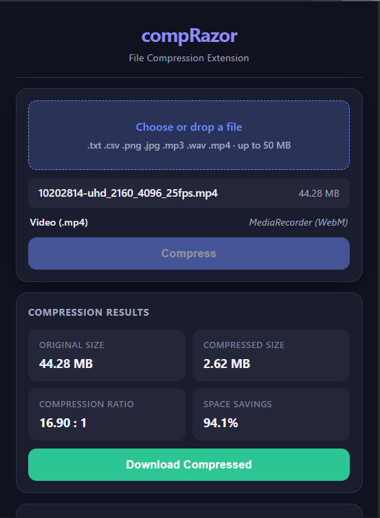
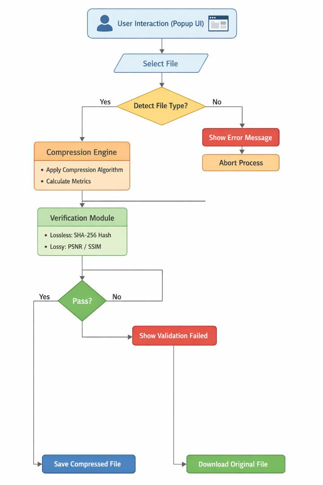
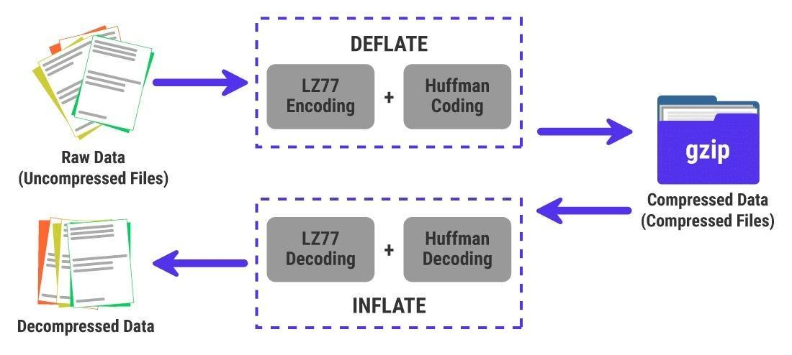
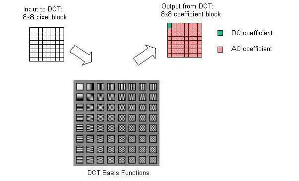
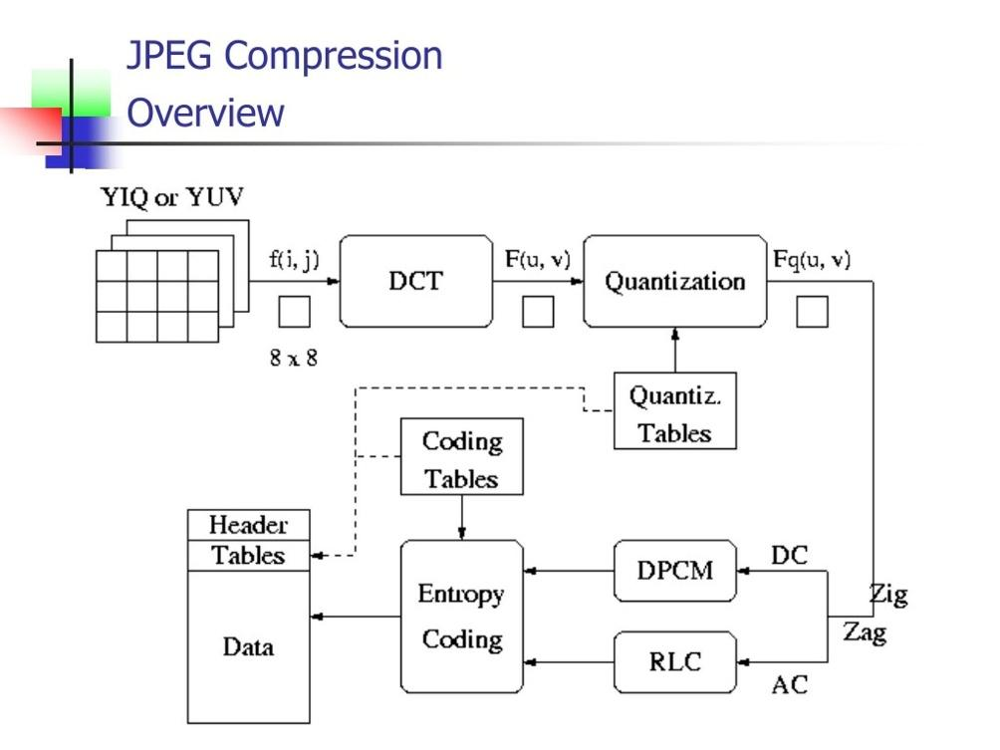
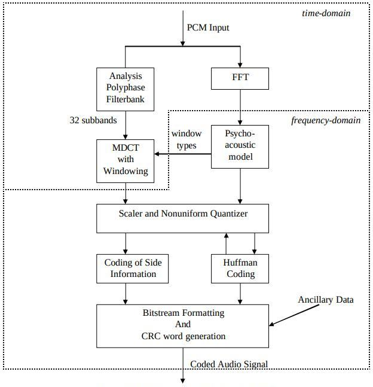
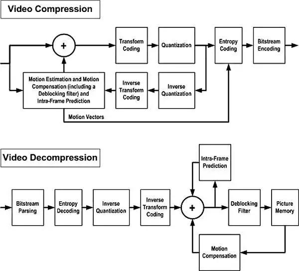

# compRazor - File Compression Chrome Extension

**Team Name:** Chhole Bhature  

---

## Overview

compRazor is a Chrome extension that compresses files directly in the browser — no external servers, no extra tools. It supports four major file types: text (.txt, .csv), images (.png, .jpg), audio (.wav, .mp3), and video (.mp4).

The extension uses **lossless compression** (GZIP) for text files and PNG images, and **lossy compression** (JPEG re-encoding, MP3 encoding, WebM transcoding) for media files. After compression, users can verify rebuild quality through SHA-256 hash comparison (lossless) or PSNR/SSIM metrics (lossy).

From a theoretical standpoint, compression is rooted in information theory, where the concept of entropy determines how much a file can be compressed. Highly redundant data — such as text files — can be compressed very effectively, whereas already-optimized or random data offers limited potential. compRazor integrates these theoretical principles with a real-world, accessible browser-based implementation.

---

## Features

- **Text compression** (.txt, .csv): Lossless GZIP compression via fflate with SHA-256 hash verification
- **Image compression**:
  - PNG: Lossless re-encoding via UPNG.js with optimized zlib settings
  - JPEG: Lossy re-encoding via jpeg-js with adjustable quality
- **Audio compression**:
  - WAV to MP3 conversion at 128 kbps via lamejs
  - MP3 re-encoding at lower bitrate (96 kbps)
- **Video compression**: MP4 to WebM transcoding via browser MediaRecorder API
- **Compression metrics**: Original size, compressed size, compression ratio, space savings percentage
- **Rebuild verification**:
  - Lossless files: SHA-256 hash comparison (byte-for-byte identity check)
  - Lossy images: PSNR (dB) and SSIM quality metrics
  - Lossy audio/video: Bit-rate comparison
- **Error handling**: User-facing error messages for unsupported files, oversized files, and compression failures
- **Download support**: Download both compressed and decompressed files directly from the extension

---

## Installation

1. Download or clone this repository
2. Open Google Chrome and navigate to `chrome://extensions/`
3. Enable **Developer mode** using the toggle in the top-right corner
4. Click **Load unpacked** and select the `compRazor` folder (the one containing `manifest.json`)
5. The compRazor icon will appear in your Chrome toolbar
6. Click the icon to open the compression popup

To install from a `.crx` file:
1. Navigate to `chrome://extensions/`
2. Enable **Developer mode**
3. Drag and drop the `.crx` file onto the extensions page
4. Confirm the installation

---

## User Interface

The UI follows a minimal, linear workflow: file upload → compression trigger → results display → download options → rebuild verification.

---

## How to Use

1. **Click the compRazor icon** in the Chrome toolbar to open the popup
2. **Click "Choose File"** and select a supported file (.txt, .csv, .png, .jpg, .wav, .mp3, or .mp4)
3. The extension auto-detects the file type and shows the compression algorithm
4. **Click "Compress"** to start compression
5. View the **compression results**: original size, compressed size, ratio, and savings
6. **Click "Download Compressed File"** to save the compressed version
7. To verify rebuild quality:
   - Click **"Upload Compressed File"** in the Rebuild Verification section
   - Upload the previously downloaded compressed file
   - View the verification result (SHA-256 match for lossless, PSNR/SSIM for lossy)
   - Click **"Download Decompressed File"** to save the reconstructed file

---

## System Architecture

compRazor follows a modular client-side architecture — all operations are performed within the browser, eliminating server dependency and ensuring fast processing for small-to-medium files.

| Component | Files | Responsibility |
|-----------|-------|----------------|
| UI Layer | `popup.html`, CSS | User interaction and display |
| Controller Layer | `popup.js` | File type detection, routing to algorithm |
| Compression Engine | — | Algorithm execution, encoding/decoding |
| Verification Module | — | SHA-256 hashing (lossless), PSNR/SSIM (lossy) |
| Browser APIs | SubtleCrypto, MediaRecorder | Hashing and video processing |

---

## Compression Algorithms

Compression is not a one-size-fits-all process. Different data types exhibit different patterns of redundancy and require specialized algorithms for optimal results.

### Text Compression — GZIP

Text data contains significant repetition in characters and words. GZIP exploits this by combining two techniques: **LZ77** (dictionary-based pattern matching) and **Huffman coding** (statistical encoding). The result is completely lossless compression with ratios typically in the 50–70% range. Ideal for documents, logs, and CSV files.

### PNG Compression — Lossless Image Re-encode

PNG compression reduces redundancy between neighboring pixels while preserving exact image quality. It applies pixel-difference filtering followed by zlib compression. No quality is lost, though already-optimized PNGs may show minimal improvement.

### JPEG Compression — Lossy Image Re-encode

JPEG achieves high compression by transforming image data into frequency components and discarding less perceptually important details. The process: divide into 8×8 pixel blocks → apply Discrete Cosine Transform (DCT) → quantize coefficients. An adjustable quality parameter lets users control the compression-vs-quality trade-off. Typical reduction: 60–80%.

### Audio Compression — MP3 (MPEG Layer III)

MP3 compression leverages the psychoacoustic model — human auditory limitations — to remove sounds outside the hearing range and masked frequencies. WAV files are converted to MP3 at 128 kbps; existing MP3s are re-encoded at 96 kbps. This achieves very high compression (~80–90%), though re-encoding an already-lossy MP3 introduces generation loss.

### Video Compression — WebM (VP8/VP9)

Video compression reduces both spatial redundancy (within frames) and temporal redundancy (between frames) using motion estimation and inter-frame prediction. The browser's native MediaRecorder API handles transcoding from MP4 to WebM, avoiding the need for heavy libraries like ffmpeg.wasm (~30 MB). Compression is real-time — the video must play through during processing.

---

## Algorithm Summary

| File Type | Library | Algorithm | Why Chosen |
|-----------|---------|-----------|------------|
| Text (.txt, .csv) | **fflate** | GZIP (DEFLATE + headers) at level 9 | Smaller (~29 KB) and faster than pako. Pure JS, no dependencies. 60–80% reduction on natural language text. |
| PNG | **UPNG.js** | PNG re-encode with optimized zlib | Keeps output as valid PNG. Supports palette reduction for additional savings while staying lossless. Requires pako as a dependency. |
| JPEG | **jpeg-js** | JPEG DCT-based re-encoding | Pure JS JPEG encoder/decoder with quality parameter (1–100). |
| WAV/MP3 | **lamejs** | MPEG Layer III (MP3) encoding | Pure JS MP3 encoder. Converts WAV PCM to MP3 at configurable bitrate. Well-established library. |
| MP4 | **MediaRecorder API** | VP8/VP9 codec in WebM container | Browser-native, zero library size. Avoids bundling ffmpeg.wasm (~30 MB). |
| Hash verification | **SubtleCrypto** | SHA-256 | Built into Chrome, zero dependencies, cryptographically secure. |

---

## Experimental Results

| File Type | Original Size | Compressed Size | Ratio | Space Savings |
|-----------|--------------|-----------------|-------|---------------|
| Text (.txt) | 2 KB | 0.9 KB | 2.2:1 | 55% |
| PNG Image | 1.2 MB | 0.95 MB | 1.26:1 | 21% |
| JPEG Image | 2.5 MB | 0.8 MB | 3.1:1 | 68% |
| WAV → MP3 | 10 MB | 1.2 MB | 8.3:1 | 88% |
| MP3 (re-encode) | 5 MB | 3 MB | 1.67:1 | 40% |
| MP4 → WebM | 20 MB | 6 MB | 3.3:1 | 70% |

**Key observations:**
- Text achieves the highest lossless efficiency due to character-level redundancy
- Audio/video achieve maximum size reduction via lossy compression
- PNG shows limited improvement, especially on already-optimized files

*Results will vary based on file content.*

---

## Rebuild Verification

Ensuring compressed data can be faithfully reconstructed is a core feature of compRazor.

### Lossless Files (Text, PNG)
- SHA-256 hash is computed for the original file before compression
- After decompression, the hash is recomputed and compared
- A perfect match confirms byte-for-byte identical reconstruction

### Lossy Files (JPEG, Audio, Video)
- **JPEG**: PSNR and SSIM are computed by comparing original and compressed pixel arrays
  - PSNR > 40 dB = excellent quality
  - PSNR 30–40 dB = good quality
  - PSNR < 25 dB = degraded quality
  - SSIM ranges from 0 to 1 (1 = identical)
- **Audio**: Bit-rate comparison (e.g., WAV 1411 kbps → MP3 128 kbps)
- **Video**: Bit-rate comparison (e.g., MP4 2500 kbps → WebM 500 kbps)

---

## Limitations

| Limitation | Detail |
|------------|--------|
| Maximum file size | 50 MB (browser memory constraint) |
| Video output format | WebM (VP8) only — MediaRecorder does not support H.264/MP4 output |
| Video compression speed | Real-time — the video must play through during compression |
| MP3 re-encoding | Introduces generation loss on already-lossy files |
| Browser compatibility | Tested on Google Chrome; MediaRecorder may not work elsewhere |
| PNG re-compression | Already-optimized PNGs may see minimal reduction |
| No batch processing | Files must be compressed one at a time |

---

## Future Scope

- Batch file compression
- AI-based adaptive compression techniques
- WebAssembly-based FFmpeg integration for broader format support
- Adaptive compression selection based on file content analysis
- Cross-browser support

---

## References

1. **fflate** — https://github.com/101arrowz/fflate
2. **UPNG.js** — https://github.com/nickyout/UPNG.js
3. **jpeg-js** — https://github.com/jpeg-js/jpeg-js
4. **lamejs** — https://github.com/nickyout/lamejs
5. **pako** — https://github.com/nickyout/pako
6. **Web Crypto API (SubtleCrypto)** — https://developer.mozilla.org/en-US/docs/Web/API/SubtleCrypto
7. **MediaRecorder API** — https://developer.mozilla.org/en-US/docs/Web/API/MediaRecorder
8. **Chrome Extensions Manifest V3** — https://developer.chrome.com/docs/extensions/mv3/
9. Shannon, C. E. — Information Theory
10. JPEG, MP3, WebM standards

---

## Team Contributions

| Name | Contribution |
|------|-------------|
| Daksh | 16.66% |
| Ayush | 16.66% |
| Tanishq | 16.66% |
| Hussain | 16.66% |
| Talha | 16.66% |
| Ashish | 16.66% |
